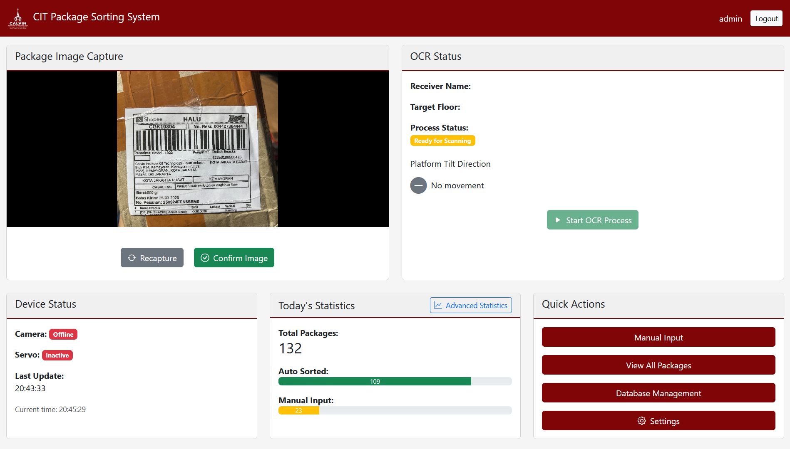
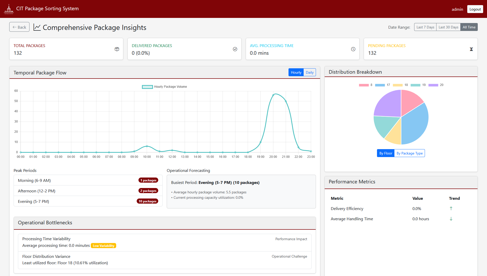
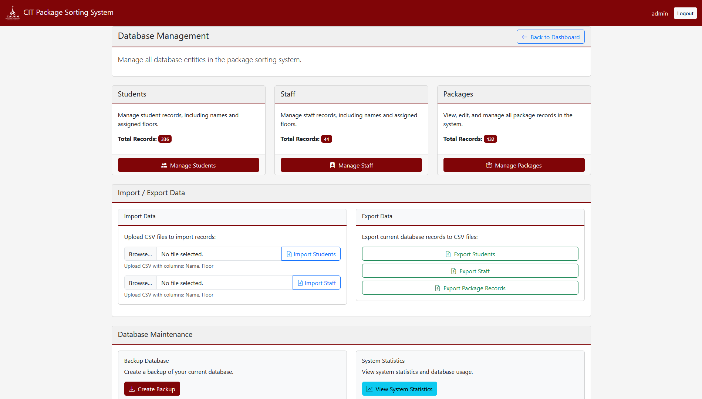

# CIT Package Sorting System

Welcome to the CIT Package Sorting System! This project is a Flask-based web application designed to streamline package management and sorting within a campus environment using Optical Character Recognition (OCR).

## Overview

The system captures images of package labels (either via webcam or direct upload), uses OCR to extract recipient information, matches it against a database of students and staff, and suggests a target floor for sorting. It includes a comprehensive dashboard for monitoring, manual data entry, database management, and advanced statistical insights into package processing.

## Key Features

*   **Web-Based Dashboard**: Centralized interface for all operations.
*   **OCR-Powered Sorting**: Automated package label reading and recipient identification.
*   **Flexible Image Input**: Supports live webcam capture and image uploads.
*   **Manual Package Entry**: Fallback for packages where OCR is not feasible.
*   **User Authentication**: Secure access to the system.
*   **Comprehensive Database Management**: CRUD operations for students, staff, and packages.
*   **Data Import/Export**: Bulk import/export of student and staff data via CSV.
*   **Database Backup**: Secure your package and user data.
*   **Configurable OCR**: Adjust image preprocessing width, name matching threshold, and toggle GPU/CPU for OCR.
*   **IoT Device Integration**: Displays status of camera and servo (for physical sorting platform).
*   **Advanced Statistics**: In-depth analytics on package flow, processing times, and distribution.
*   **Accuracy & Optimization Tools**: Scripts to test OCR accuracy and optimize parameters.

## Tech Stack

*   **Backend**: Python, Flask, SQLAlchemy
*   **Frontend**: HTML, CSS (Bootstrap 5), JavaScript (Chart.js)
*   **OCR**: Keras-OCR, TensorFlow
*   **Database**: SQLite
*   **Fuzzy Matching**: RapidFuzz

## Prerequisites

*   **Python**: Version 3.7-3.10 (due to TensorFlow 2.10 dependency).
*   **pip**: Python package installer.
*   **Virtual Environment** (recommended): `venv` or `conda`.
*   **(Optional for GPU OCR)**:
    *   NVIDIA GPU
    *   CUDA Toolkit (compatible with TensorFlow 2.10, e.g., CUDA 11.2)
    *   cuDNN (compatible with TensorFlow 2.10, e.g., cuDNN 8.1)

## Setup and Installation

1.  **Clone the Repository**:
    ```bash
    git clone <repository-url>
    cd CIT-Package-Sorting-System
    ```

2.  **Create and Activate a Virtual Environment** (Recommended):
    *   Using `venv`:
        ```bash
        python -m venv venv
        # On Windows
        venv\Scripts\activate
        # On macOS/Linux
        source venv/bin/activate
        ```
    *   Using `conda`:
        ```bash
        conda create -n citpackagesort python=3.9  # Or your preferred Python version (3.7-3.10)
        conda activate citpackagesort
        ```

3.  **Install Dependencies**:
    ```bash
    pip install -r requirements.txt
    ```
    *Note: If you encounter issues with TensorFlow, ensure your Python, CUDA, and cuDNN versions are compatible. TensorFlow 2.10 is specified.*

4.  **Keras-OCR Models**:
    The system uses Keras-OCR. The pre-trained models for Keras-OCR will be downloaded automatically on first use if not already cached. The custom recognizer model `models/recognizer_with_augment.h5` should be present in the `models` directory at the project root.

5.  **Initial Data (Optional)**:
    *   The database (`instance/packages.db`) will be created automatically when you first run the application.
    *   To populate initial student and staff lists:
        *   You can use the CSV files in the `database_list/` directory (`list_staff.csv`, `mahasiswa_dorm.csv`).
        *   Import them via the "Database Management" -> "Import / Export Data" section in the web UI after starting the application.

## Running the Application

1.  **Start the Flask Server**:
    ```bash
    python app.py
    ```

2.  **Access the Application**:
    Open your web browser and go to `http://localhost:5000`.

3.  **Login**:
    *   The default administrator credentials are:
        *   Username: `admin`
        *   Password: `password`
    *   These are created if no 'admin' user exists on the first run.

## Using the System

*   **Dashboard**: Main overview page. Use the "Package Image Capture" section for OCR processing or image upload. View IoT device status and daily statistics.
*   **Manual Input**: Navigate via "Quick Actions" to manually log packages.
*   **Database Management**:
    *   **Manage Students/Staff**: Add, edit, or delete student and staff records.
    *   **Import/Export Data**: Upload CSV files for students or staff, or export existing data.
    *   **Backup Database**: Create a backup of the `packages.db` file.
    *   **System Statistics**: View counts of records, package statuses, database size, uptime, etc.
*   **View All Packages**: Browse, filter, edit, and manage all logged packages. Mark packages as "Delivered".
*   **Settings**:
    *   Accessible from "Quick Actions" on the dashboard.
    *   Configure OCR settings:
        *   **Image Preprocessing Width**: Target width for image resizing before OCR (0 to disable).
        *   **Name Matching Threshold**: Sensitivity for matching OCR'd names to the database (0.0 to 1.0).
        *   **Processing Hardware**: Choose between GPU or CPU for OCR. *Requires application restart to take effect.*
*   **Advanced Statistics**: Access detailed visual reports on package processing trends and efficiency.

## OCR Accuracy & Optimization Tools

The project includes several command-line scripts for testing and optimizing OCR performance. Ensure your virtual environment is activated before running these scripts from the project root directory.

*   **Test Data**: Place your test images in the `test_data/` directory (you may need to create this directory if it doesn't exist).
*   **Output Directories**: Results are typically saved in `ocr_accuracy_results/` and `parameter_optimization_results/`.

1.  **`accuracy.py`**:
    *   Compares the performance of the base Keras-OCR model against the custom trained model (`models/recognizer_with_augment.h5`).
    *   Involves interactive verification of results.
    *   **Usage**:
        ```bash
        python accuracy.py --images test_data --results ocr_accuracy_results [--gpu]
        ```

2.  **`new_accuracy_check.py`**:
    *   Provides a detailed accuracy check for the trained model and helps manage ground truth data stored in `ocr_accuracy_results/ground_truth.json`.
    *   **Usage**:
        ```bash
        python new_accuracy_check.py
        ```
        *(Assumes test images in `test_data/` and ground truth/results in `ocr_accuracy_results/`)*

3.  **`brute_force.py` (OCR Parameter Optimizer)**:
    *   Performs a grid search to find optimal `ocr_preprocess_width` and `match_threshold` values.
    *   Requires a ground truth JSON file (which can be generated/managed using `new_accuracy_check.py`).
    *   **Usage Example**:
        ```bash
        python brute_force.py --ground-truth ocr_accuracy_results/ground_truth.json --images test_data --model models/recognizer_with_augment.h5 --results parameter_optimization_results [--gpu] [--min-width 480 --max-width 720 --width-step 80] [--min-threshold 0.30 --max-threshold 0.40 --threshold-step 0.01]
        ```
        *Adjust ranges and steps as needed.*

4.  **`new_evaluate_predictor.py`**:
    *   Evaluates the performance of the name matching algorithm (`predictor.py`) using previously generated OCR results and ground truth.
    *   Assumes OCR results are available in `ocr_accuracy_results/`.
    *   **Usage**:
        ```bash
        python new_evaluate_predictor.py
        ```

## Directory Structure

```
CIT-Package-Sorting-System/
├── app.py                      # Main Flask application
├── models.py                   # Database models (SQLAlchemy)
├── extensions.py               # Flask extensions setup (SQLAlchemy, app instance)
├── predictor.py                # Name matching and prediction logic
├── ocr_module.py               # OCR pipeline initialization and processing
├── routes/                     # Flask Blueprints for different app sections
│   ├── auth.py                 # Authentication routes (login, logout)
│   ├── database_import_export.py # CSV import/export routes
│   └── db_crud.py              # CRUD operations for database entities
├── templates/                  # HTML templates for the web interface
├── static/                     # Static assets (CSS, JavaScript, images like logos)
│   ├── css/
│   ├── js/
│   └── images/ (e.g., cit_logo_white.png, cit_logo.png)
├── instance/                   # Instance-specific data (e.g., packages.db - auto-created)
├── database_list/              # Sample CSVs for initial student/staff data
│   ├── list_staff.csv
│   └── mahasiswa_dorm.csv
├── models/                     # Directory for Keras-OCR model files
│   └── recognizer_with_augment.h5 # Custom trained OCR recognizer model
├── test_data/                  # Recommended: Place OCR test images here
├── ocr_accuracy_results/       # Default output for accuracy_py and new_accuracy_check.py
├── parameter_optimization_results/ # Default output for brute_force.py
├── accuracy.py                 # Script for comparing base vs. trained OCR model
├── new_accuracy_check.py       # Script for detailed accuracy checking & ground truth management
├── brute_force.py              # Script for OCR parameter optimization (width, threshold)
├── new_evaluate_predictor.py   # Script for evaluating the name predictor component
├── requirements.txt            # Python dependencies
├── esp/                        # IoT device code
│   └── wemos.ino              # WeMos ESP8266 firmware
└── README.md                   # This file
```

## IoT Device Communication

The system uses a WeMos ESP8266 microcontroller to handle the physical package sorting mechanism. The device controls two servo motors (pan and tilt) to direct packages to different floors.

### Hardware Components
* WeMos ESP8266 board
* 2 Servo motors (pan and tilt)
* Buzzer for audio feedback
* WiFi connectivity

### Features
* **Automatic WiFi Connection**: Automatically connects to known WiFi networks
* **Web Server**: Exposes HTTP endpoints for remote control
* **Servo Control**: 
  * Pan servo (horizontal movement)
  * Tilt servo (vertical movement)
* **Floor Positions**: Supports 4 sorting positions (Floors 17-20)
  * Floor 17: Back position
  * Floor 18: Left position
  * Floor 19: Front position
  * Floor 20: Right position
* **Status Monitoring**: Reports device status, servo positions, and WiFi connection details
* **Error Handling**: Provides audio feedback for invalid commands or errors
* **Serial Commands**: Supports manual control through serial monitor

### API Endpoints
* **GET `/status`**: Returns device status including:
  * WiFi connection status
  * IP address
  * Connected SSID
  * Current servo positions
* **POST `/sort`**: Accepts JSON payload with floor number:
  ```json
  {
    "floor": "17-20"
  }
  ```
  * Returns success/error status
  * Floor 999 signals an error/no match

### Serial Commands
* `17-20`: Direct floor number input for sorting
* `sort 17-20`: Alternative way to trigger sorting
* `ip`: Display device IP address
* `wifi`: Show connected WiFi name
* `help`: Display available commands

### Implementation Details
The device's source code (`esp/wemos.ino`) implements:
* Servo position management with smooth movements
* Position memory to prevent servo jitter
* Auto-reconnection for WiFi stability
* Error detection and feedback
* REST API endpoints for remote control
* Serial interface for manual control and debugging

### Screenshots

#### Main Dashboard

The main dashboard interface showing:
* Package image capture area with webcam feed/upload
* OCR status panel showing receiver name, target floor, and process status
* Device status showing camera and servo connectivity
* Today's statistics with package counts and sorting methods
* Quick actions menu for common operations

#### Package Analytics

Comprehensive package insights showing:
* Key metrics (total packages, delivered packages, processing time, pending packages)
* Temporal package flow graph with hourly/daily views
* Distribution breakdown by floor (pie chart)
* Peak period analysis
* Operational forecasting
* Performance metrics and bottleneck identification

#### Database Management

Database management interface featuring:
* Student management (336 records)
* Staff management (44 records)
* Package records (132 records)
* Import/Export functionality for CSV data
* Database backup and maintenance tools
* System statistics viewer

## Troubleshooting

*   **TensorFlow/CUDA Issues**:
    *   Ensure your NVIDIA drivers, CUDA Toolkit, and cuDNN versions are compatible with TensorFlow 2.10.
    *   If GPU is not detected or causes errors, try running with CPU by setting "Processing Hardware" to CPU in the application's Settings page (requires app restart), or by not using the `--gpu` flag for command-line scripts.
*   **Module Not Found Errors**:
    *   Make sure your virtual environment is activated.
    *   Ensure all dependencies are installed: `pip install -r requirements.txt`.
*   **Database Issues**:
    *   If `instance/packages.db` gets corrupted, you can delete it. The application will recreate it on the next run (you will lose existing data unless you have a backup).
*   **OCR Accuracy**:
    *   Use the provided accuracy and optimization scripts (`accuracy.py`, `new_accuracy_check.py`, `brute_force.py`) to test and fine-tune.
    *   Adjust "Image Preprocessing Width" and "Name Matching Threshold" in the application Settings.
    *   Ensure good quality, well-lit images for OCR.

## Contributing

Contributions are welcome! If you'd like to contribute, please follow these steps:

1.  Fork the repository.
2.  Create a new branch for your feature or bug fix.
3.  Make your changes.
4.  Write tests for your changes (if applicable).
5.  Ensure all tests pass.
6.  Submit a pull request with a clear description of your changes.

## License

This project is licensed under the MIT License - see the [LICENSE](LICENSE) file for details.

---

Thank you for using the CIT Package Sorting System! 